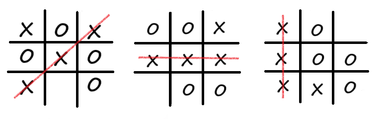
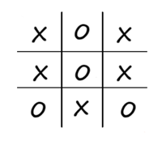

# tic-tac-toe (XO)
- It is a game for two players.
- It is usually played on a 3x3 board, but it can be wider.
- The player who started first fills in the empty squares by typing ‘X’ and the other player ‘O’.
- A player wins the game when they X-X-X or O-O-O in rows, columns, or diagonals.

- If all squares filled and were provided one from the above conditions be the game is tied.

| Win mode | The number of win mode |
| -------- | ---------------------- |
| A Line   | XXX - OOO  3 mode      |
| A Column | XXX - OOO  3 mode      |
| A Cross  | XXX - OOO  2 mode      |